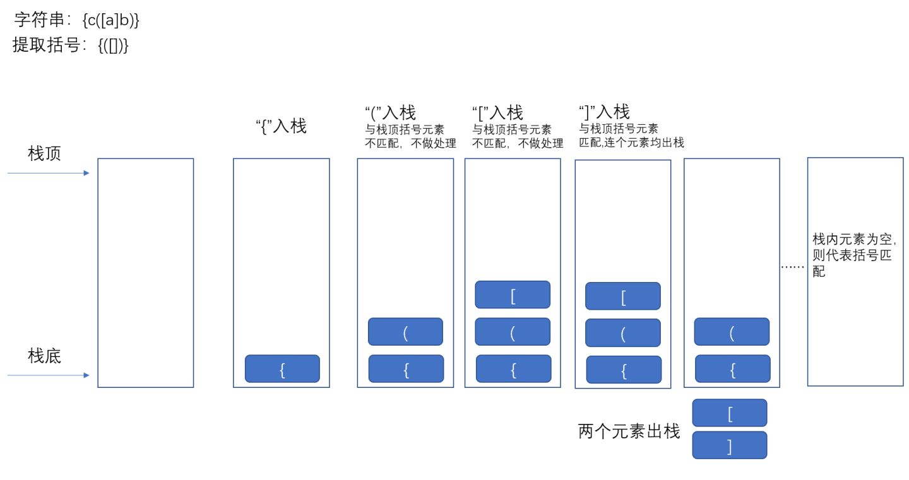

---

title: LeetCode题解：括号匹配算法
date: 2023-01-21 23:11:58
tags: leetcode
categories: "leetcode"
updated: 2023-03-17 09:04:36

---

## 括号匹配算法

左*括号*必须用相同类型的右*括号*闭合。 左*括号*必须以正确的顺序闭合。 注意空字符串可被认为是有效字符串。

<!--more-->

### 1.实现目标

在开发中，会出现需要判断字符串是否匹配的问题，如文本编辑器中括号不匹配会出现格式错误（如以下字符串），这就需要括号匹配算法

```
dsa(dsadsa{dhk)s})}
```

### 2.实现思路



由于括号是与最近的同类型括号匹配，可以利用栈的后进先出特性将右括号与最近的左括号匹配，如果不匹配，直接返回false

### 3.具体实现

当括号数量为奇数时直接返回false，为0直接返回true。

核心逻辑：循环遍历字符串每一个字符，判断是左括号则入栈，num++，若是右括号则num--，让该括号与栈顶括号匹配，若相同则弹出栈，不同则什么都不做，这样就可以跳过普通字符而判断括号是否匹配

为什么要设置num：设置变量num统计左括号的数目，当有右括号时num--，这是为了判断左右括号的数目要相同，但是还要判断是否为同类括号

改进方法：判断isMatch（）时在后面加else，就不用判断num了，但是使用原方法leetcode速度更快，内存也更小

代码

```javascript
<script>	
    let isValid = funtion(str){
        const len = str.length
        if(len%2===1)
            return false
        if(len===0)
            return true
        
        str = str.split('')
        let stack = []
        const leftBracket = '{[('
        cosnt rightBracket = '}])'
        let a = str[0]
        if(rightBracket.includes(a))
            return false
        
        for(let i = 0;i<len;i++)
            if(leftBracket.includes(str[i]))
                stack.push(str[i])
        		num++
        	else if(rightBracket.includes(str[i]))//
                num--
                let top = stack[stack.length-1]
                if(isMatch(top,str[i]))
                    stack.pop()
        		/*
        		else
        			return false		此时就不用num了
        		*/
        if(num===0&&stack.length===0)
            return true
        else 
            return false
        
        
    }


	funtion isMatch(left,right){
        if(left==='{'&&right==='}'){
            return true
        }else if(left==='['&&right===']'){
            return true
        }else if(left==='('&&right===')'){
            return true
        }else
            return false
    
</script>
```

