本文记录了爬虫最基础的使用方法，如果只想最快获得网页源码从2.2浏览即可

<!--more-->

## 1、爬虫核心库1：requests库

学习爬虫其实并不太需要了解太多的网页结构知识，作为初学者只需要知道1点：所有想要获取的内容（例如新闻标题/网址/日期/来源等）都在网页源代码里，所谓网页源代码，就是网页背后的编程代码，这一小节我们首先来讲解下如何查看网页源代码，以及通过两个案例快速体验下如何通过requests库获取网页源代码。

### 1.1 如何查看网页源代码

在进入正式爬虫实战前，我们首先来了解下如何查看网页源代码。

网络爬虫首先得有一个浏览器，这里强烈推荐谷歌浏览器（百度搜索谷歌浏览器，然后在官网[https://www.google.cn/chrome/](https://www.google.cn/chrome/)下载，谷歌浏览器默认是谷歌搜索，直接在网址输入框里输入内容可能搜索不到内容，可以在网址栏上输入baidu.com进行访问，或者可以点击浏览器右侧的设置按钮->选择界面左侧的搜索引擎->选择百度搜索引擎）。当然用别的浏览器，比如火狐浏览器等都是可以的，只要它按F12(有的电脑要同时按住左下角的Fn键)能弹出网页源代码即可。

以谷歌浏览器为例来演示下F12的强大作用，百度搜索“阿里巴巴”，然后**按一下F12（有的电脑还得同时按住Fn）**，弹出如下页面，其中点击右侧设置按钮可以切换布局样式。

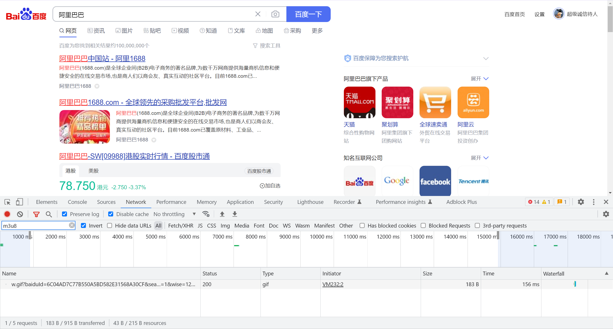

这个按住F12弹出来的东西叫做开发者工具，是进行数据挖掘的利器，对于爬虫来说，大多数情况下只需要会用下图的这两个按钮即可。

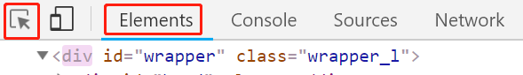

第一个按钮箭头形状按钮为**选择**按钮，第二个Elements按钮为**元素**按钮。

**(1)** **选择按钮**

点击一下它，发现它会变成蓝色，然后把鼠标在页面上移动移动，会发现页面上的颜色机会发生改变。如下图所示，当**移动鼠标**的时候，会发现界面上的颜色会发生变化，并且Elements里的内容就会随之发生变化。

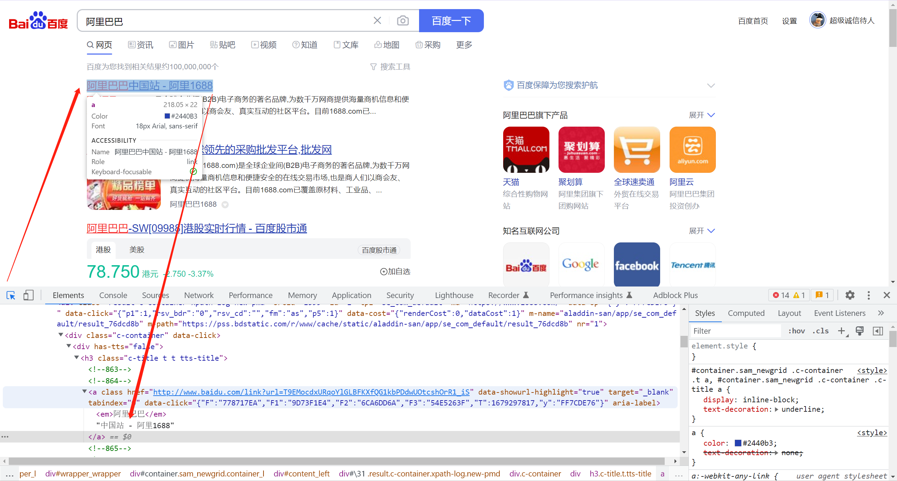

下面当选择按钮处于蓝色状态的时，点击一下第一个链接的标题，这时候选择按钮再次变成灰色，而Elements里的内容也将不再变动，此时便可以观察具体的网页源代码内容了，如下图所示，我们一般只关心里面的所需要的中文内容，如果没有看到中文文本，店家下图所示的三角箭头，即可展开内容，看到中文文本。

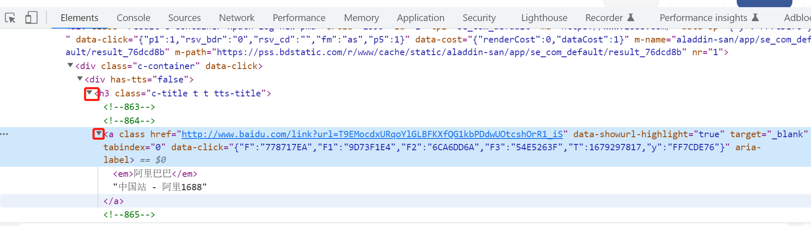

**(2) Elements元素按钮**：

Elements元素按钮里面的内容可以理解为**就是网站的源码**，最后爬虫爬到的内容大致就是长这个样子的。下面就要接着完成一些“神奇”的操作。

在下图“**1688”**那个地方鼠标双击俩下，这两个字变成可编辑的格式。

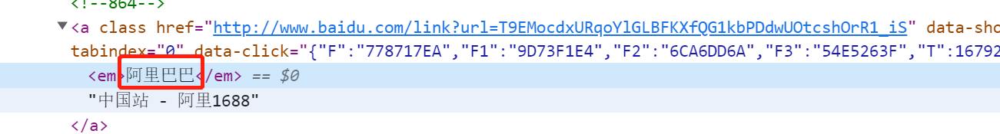

将其改成“测试”，可以看到第一个的标题发生了改变，如下图所示：

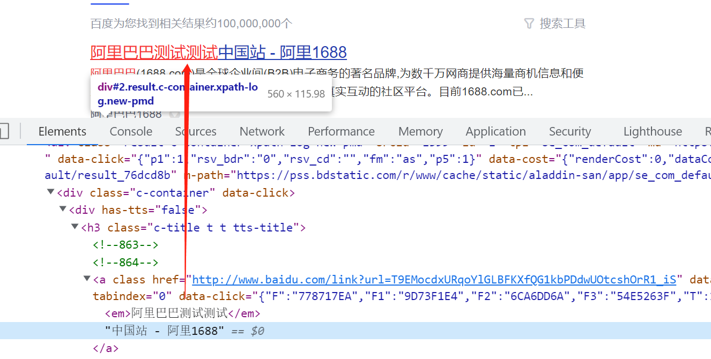

还可以用同样的操作，修改页面上的其他信息，如股价等。

通过F12启动开发者工具，我们可以对网页结构有一个初步的认识，并可以利用选择按钮和“Elements”元素按钮观察我们想获取的内容在源码中的文本格式以及所在位置。

**补充知识点1：查看网页源码的另一个方式**

除了F12，另一个获取网页源码的方式是在网页上右击选择“**查看网页源代码**”，就可以获取这个网址的源代码，这个基本就是Python爬取到的最终信息。用鼠标上下滚动，就能看到很多内容，同样初学者不需要关心那些英文或者网页框架，只需要知道想获取的中文在哪里即可。

这个方法比F12观察源码的方式更加真实，因为F12观察到的源码可能是被网页修饰过的，通过Python获取到内容可能和F12看到的不一致。通过该方法查看到的源码就是通过Python程序能够获取到的网页源代码。实战中常将两种方法联合使用：通过F12进行初步了解，然后右击查看网页源代码，看看所需内容到底在网页源代码的什么位置，其中可以通过Ctrl + F快捷键搜索所需要的内容。

此外，如果F12看到的内容和通过右击查看网页源代码看到的内容很不一样，这是因为网站做了动态渲染的处理（这是一种反爬处理），这时候就需要用到2.2节selenium库的相关知识点来获取真正的网页源代码。

**补充知识点2：http与https协议**

有的时候我们理解的网址是：[http://www.baidu.com]([http://www.baidu.com)，但其实在编程里或者它真实的名字其实是：[https://www.baidu.com](https://www.baidu.com)，它前面有个“https://”这个叫做https协议，是网址的固定构成形式，某种程度表明这个网址是安全的，有的网址前面则为http://。如果在Python里输入[www.baidu.com](https://link.zhihu.com/?target=http%3A//www.baidu.com/)它是不认识的，得把“https://”加上才行，如下面所示。

```text
url = 'https://www.baidu.com/'
```

其实最简单的办法，**就是直接浏览器访问该网址，然后把链接复制下来就行**。

### 1.2 爬虫初尝试 - requests库获取网页源代码

了解了如何查看网页源代码后，这一小节我们讲解下如何通过requests库爬取网页源代码。这里以一个学校的招聘网站为例。

**（1） 获取网页源代码**

通过第一章最后介绍的requests库来尝试获取下新闻的网页源代码，代码如下：

```python
import requests
url = 'https://www.163.com/dy/article/I09JUB0P051984TV.html'
res = requests.get(url).text
print(res)
```

运行后报错：

`requests.exceptions.SSLError: HTTPSConnectionPool`

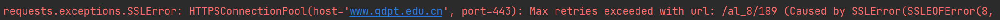

这是由于ssl认证失败造成的，我们并不需要知道原因，只要像以下一样禁用ssl认证就可以了。

```python
import requests

s = requests.session()
s.trust_env = False
s.keep_alive = False
requests.DEFAULT_RETRIES = 50

url = 'https://www.gdpt.edu.cn/al_8/189'
res = s.get(url).text
print(res)
```

这段代码使requests的连接禁用了ssl认证，不使用keep-alive，并将重连次数增加到了50，如果出现了类似的错误只需要将以上代码复制粘贴即可。运行后得到以下结果。

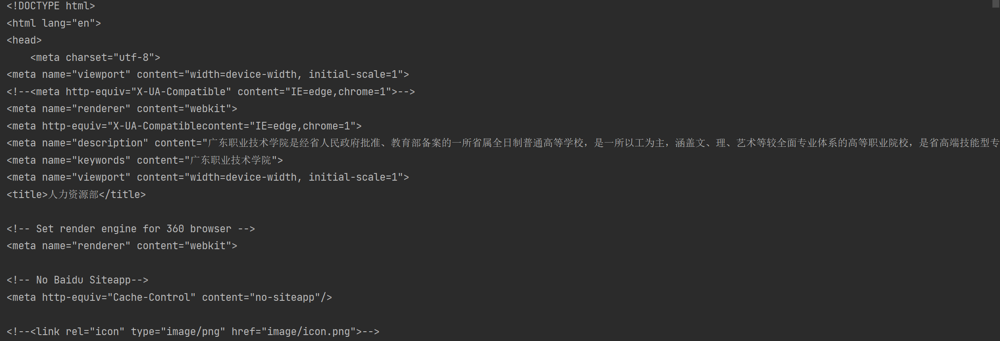

这里虽然得到了结果，但是有的网站只认可浏览器发送过去的访问，而不认可直接通过Python发送过去的访问请求，那么该如何解决该问题呢？这时就需要设置下requests.get()中的headers参数，用来模拟浏览器进行访问。

```python
import requests

s = requests.session()
s.trust_env = False
s.keep_alive = False
requests.DEFAULT_RETRIES = 50

headers = {'User-Agent': 'Mozilla/5.0 (Windows NT 6.1; WOW64) AppleWebKit/535.1 \
                    (KHTML, like Gecko) Chrome/14.0.835.163 Safari/535.1'}
url = 'https://www.gdpt.edu.cn/al_8/189'
res = s.get(url, headers=headers).text
print(res)
```

## 2 爬虫核心库2：selenium库

对比了我想要查询的内容，发现requests爬取的信息不是完整的，这是因为Requests只能获取到HTML文本，而无法获取到JavaScript动态生成的内容。如果div盒子里的内容是通过JavaScript生成的，那么requests就无法获取到。此时就需要使用selenium库了。

Selenium库这一知识点相对比较重要，如果说requests库能够爬取50%的网站的话，那么通过selenium库的话可以爬取95%的网站，大部分较为困难的网址都可以通过其来获取网页源代码。下面我们首先来分析下requests库在一些复杂爬虫中遇到的难点，然后讲解下如何安装selenium库以及如何通过selenium库获取到网页源代码。

### 2.1 requests库遇到的难点

在使用requests库进行爬虫实战时，有时会遇到一大难题：获取不了网页真正的源代码。例如，上海证券交易所的公开信息、新浪财经的股票行情实时数据等，用常规爬虫手段会发现获取到的网页源代码内容很少且没有用。因为这些网页上展示的信息是动态渲染出来的，而通过常规爬虫手段获取的则是未经渲染的信息，所以其中没有我们想要的信息。

以新浪财经的上证综合指数（上证综合指数反映在上海证券交易所全部上市股票价格综合情况）网页（[http://finance.sina.com.cn/realstock/]([http://finance.sina.com.cn/realstock)）为例，在浏览器中按F12 键，可以在网页源代码中看到指数数值。然后用常规爬虫手段，以requests.get(url).text 的方式获取这个网页的源代码，然后按快捷键Ctrl+F，在源代码中搜索刚才看到的指数数值，会发现搜索不到，如下图所示。而且就算加上headers 参数也没有改观。

面对这种动态渲染的网页，在数据挖掘时就需要使用Selenium 库，通过模拟打开一个浏览器访问网址，然后获取渲染后的网页源代码，从而完成requests库难以完成的任务。

| 优点       | 缺点                |                  |
| ---------- | ------------------- | ---------------- |
| requests库 | 爬取速度快          | 有些网站爬取不到 |
| selenium库 | 能爬取95%以上的网站 | 爬取速度较慢     |

### 2.2  Selenium库介绍与安装

正式介绍selenium库之前，得首先先安装一个网页模拟器：ChromeDriver，它的作用是给Pyhton提供一个模拟浏览器，让Python能够运行一个模拟的浏览器进行网页访问，并用selenium进行鼠标及键盘等操作获取到网页真正的源代码。

**(1) 安装Chrome谷歌浏览器**

安装ChromeDriver之前，得先装一下Chrome谷歌浏览器，直接百度搜索谷歌浏览器，然后在官网[https://www.google.cn/chrome/](https://www.google.cn/chrome)下载即可。

**(2) 查看Chrome浏览器版本**

地址栏输入`chrome://version`回车即可

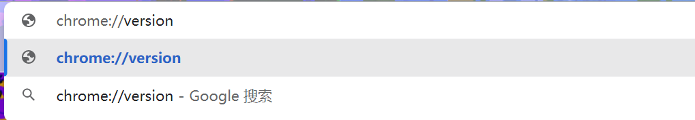

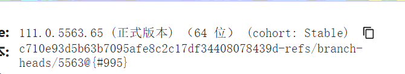

**(3) ChromeDriver下载**

ChromeDriver官方下载地址：[http://chromedriver.storage.googleapis.com/index.html](http://chromedriver.storage.googleapis.com/index.html)。进入官网后，选择对应自己谷歌浏览器版本的ChromeDriver下载即可。不过由于官网再国内经常访问不了，因此可以在百度上搜索“ChromeDriver下载”，可以找到如下一个镜像下载网站：[http://npm.taobao.org/mirrors/chromedriver/](https://registry.npmmirror.com/binary.html?path=chromedriver/)。

**(4) ChromeDriver环境变量配置**

解压压缩包，找到chromedriver.exe复制到chrome的安装目录（其实也可以随便放一个文件夹,关键是要加入环境变量）。复制chromedriver.exe文件的路径并加入到电脑的环境变量中去。具体的：

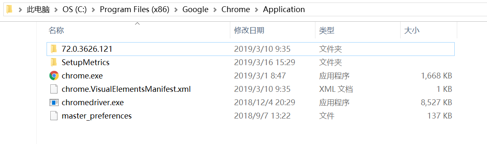进入环境变量编辑界面，添加到用户变量即可，双击PATH，将你的文件位置（C:\Program Files (x86)\Google\Chrome\Application\)添加到后面。

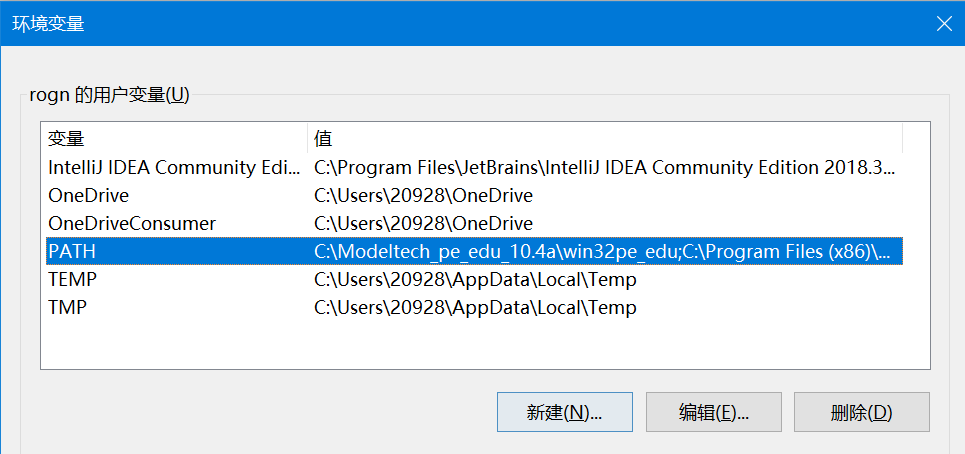

完成后在按住win+R键进入cmd，输入chromedriver验证是否安装成功：

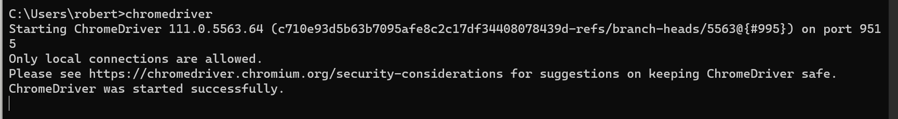

未配置环境也可以，例如：

```python
from selenium import webdriver
import time

def main():
    chrome_driver = 'C:\Program Files (x86)\Google\Chrome\Application\chromedriver.exe'  #chromedriver的文件位置
    b = webdriver.Chrome(executable_path = chrome_driver)
    b.get('https://www.google.com')
    time.sleep(5)
    b.quit()

if __name__ == '__main__':
    main()
```

已配置环境变量时，就不需要指定位置了

```python
from selenium import webdriver
import time

def main():
    b = webdriver.Chrome()
    b.get('https://www.baidu.com')
    time.sleep(5)
    b.quit()

if __name__ == '__main__':
    main()
```

如果运行时提示

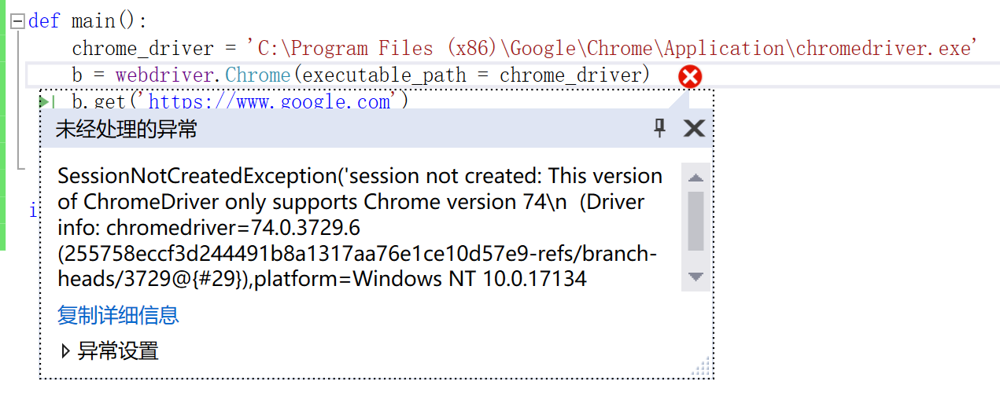

很可能是chromedriver的版本不对（不要问我怎么知道的）。

### **2.3 Selenium库获取网页源代码** 

Selenium库的功能很强大，使用技巧却并不复杂，只要掌握了下面的几个知识点，就能较游刃有余的使用selenium库了。

**(1) 访问及关闭页面 + 网页最大化**

通过以下这三行代码，就可以访问网站了，它相当于模拟人打开了一个浏览器，然后输入了一串网址：

```text
from selenium import webdriver
browser = webdriver.Chrome()
browser.get("https://www.baidu.com/")
```

第一行引入selenium库里的webdriver功能，第二行browser = webdriver.Chrome()声明我们用的模拟器是谷歌浏览器，第三行通过brower.get()的这个方法访问网址。

关闭模拟浏览器的代码如下，在代码最后加上这么一行，能关闭模拟浏览器。

```text
browser.quit()
```

**(2) 获取网页真正的源代码**

利用selenium的一个主要目的就是为了获取原来难以获得的网页源码，代码如下：

```text
data = browser.page_source
```

拿这个方法来试试之前提到过的比较难以获取的动态加载的内容：

```python
from selenium import webdriver
from selenium.webdriver import ChromeOptions

url = "https://www.gdpt.edu.cn/al_8/189"

options = ChromeOptions()
browser = webdriver.Chrome(options=options)
browser.get(url)

source = browser.page_source

with open('example.html', 'w', encoding="utf8") as f:
    f.write(source)
browser.quit()
```

这样就得到了所有的内容并以一个html文件的形式写出

### 2.4 selenium库加载登录信息

如果一个网站要求登录才能看到信息，如何使用selenium登录呢。很简单，加载浏览器登陆过的信息即可。浏览器会将用户登录过的所有数据保存在`C:\Users\电脑用户名\AppData\Local\Google\Chrome\User Data`，selenium只需要加载这个文件夹就可以了，代码如下：

```python
from selenium import webdriver
from selenium.webdriver import ChromeOptions

url = "https://www.gdpt.edu.cn/al_8/189"

# 加载cookies中已经保存的账号和密码
options = ChromeOptions()
options.add_argument(r'user-data-dir=C:\Users\电脑用户名\AppData\Local\Google\Chrome\User Data')
browser = webdriver.Chrome(options=options)
browser.get(url)

source = browser.page_source

with open('example.html', 'w', encoding="utf8") as f:
    f.write(source)
browser.quit()
```

