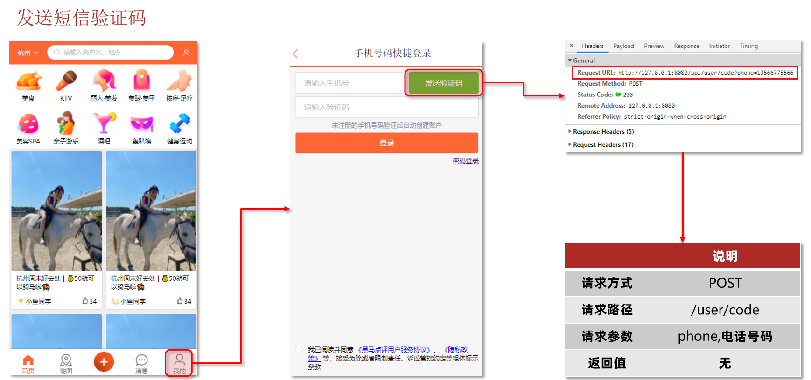
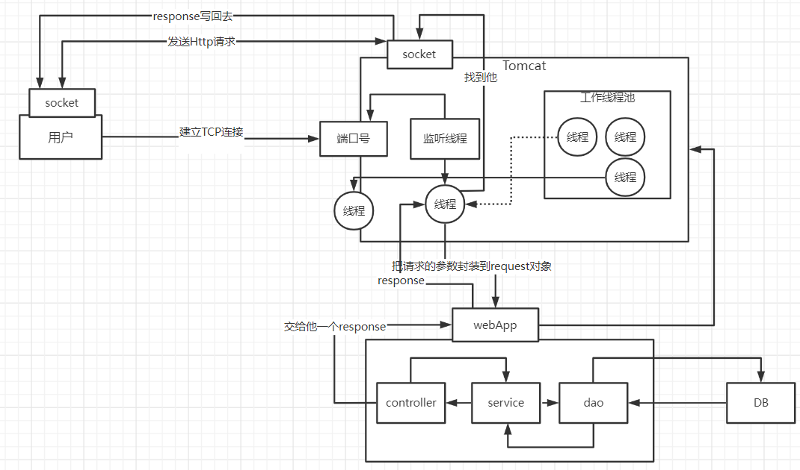
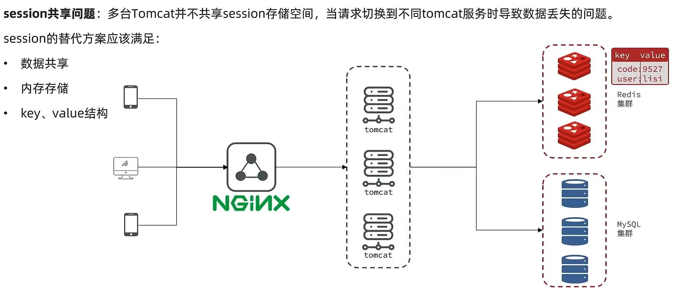
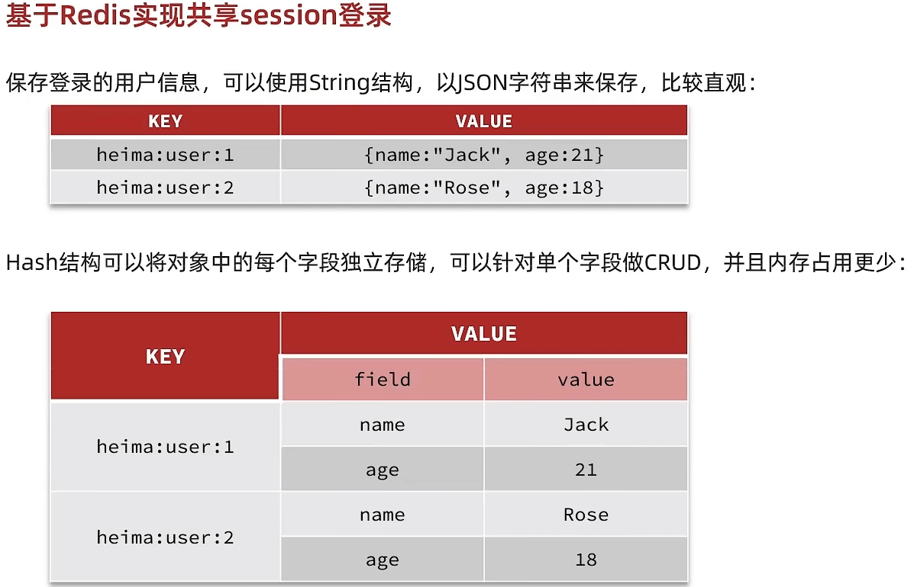

本文介绍了如何使用session进行登录及其缺点，以及如何用redis对缺点进行改进

<!--more-->

## 基于session实现登录流程

### **发送验证码：**

用户在提交手机号后，会校验手机号是否合法，如果不合法，则要求用户重新输入手机号

如果手机号合法，后台此时生成对应的验证码，同时将验证码进行保存，然后再通过短信的方式将验证码发送给用户

### **短信验证码登录、注册：**

用户将验证码和手机号进行输入，后台从 session 中拿到当前验证码，然后和用户输入的验证码进行校验，如果不一致，则无法通过校验，如果一致，则后台根据手机号查询用户，如果用户不存在，则为用户创建账号信息，保存到数据库，无论是否存在，都会将用户信息保存到 session 中，方便后续获得当前登录信息

### **校验登录状态:**

用户在请求时候，会从 cookie 中携带sessionId 到后台，后台通过 sessionId 从 session 中拿到用户信息，如果没有 session 信息，则进行拦截，如果有 session 信息，则将用户信息保存到 threadLocal 中，并且放行


## 实现发送短信验证码功能



代码如下：

```
    @Override
    public Result sendCode(String phone, HttpSession session) {
        // 1.校验手机号
        if (RegexUtils.isPhoneInvalid(phone)) {
            // 2.如果不符合，返回错误信息
            return Result.fail("手机号格式错误！");
        }
        // 3.符合，生成验证码
        String code = RandomUtil.randomNumbers(6);
 
        // 4.保存验证码到 session
        session.setAttribute("code",code);
        // 5.发送验证码
        log.debug("发送短信验证码成功，验证码：{}", code);
        // 返回ok
        return Result.ok();
    }
```

登录：

```
    @Override
    public Result login(LoginFormDTO loginForm, HttpSession session) {
        // 1.校验手机号
        String phone = loginForm.getPhone();
        if (RegexUtils.isPhoneInvalid(phone)) {
            // 2.如果不符合，返回错误信息
            return Result.fail("手机号格式错误！");
        }
        // 3.校验验证码
        Object cacheCode = session.getAttribute("code");
        String code = loginForm.getCode();
        if(cacheCode == null || !cacheCode.toString().equals(code)){
             //3.不一致，报错
            return Result.fail("验证码错误");
        }
        //一致，根据手机号查询用户
        User user = query().eq("phone", phone).one();
 
        //5.判断用户是否存在
        if(user == null){
            //不存在，则创建
            user =  createUserWithPhone(phone);
        }
        //7.保存用户信息到session中
        session.setAttribute("user",user);
 
        return Result.ok();
    }
```

## 实现登录拦截功能



当用户发起请求时，会访问我们像 tomcat 注册的端口，任何程序想要运行，都需要有一个线程对当前端口号进行监听，tomcat 也不例外，当监听线程知道用户想要和 tomcat 连接连接时，那会由监听线程创建 socket 连接，socket 都是成对出现的，用户通过 socket 像互相传递数据，当 tomcat 端的 socket 接受到数据后，此时监听线程会从 tomcat 的线程池中取出一个线程执行用户请求，在我们的服务部署到 tomcat 后，线程会找到用户想要访问的工程，然后用这个线程转发到工程中的 controller，service，dao 中，并且访问对应的 DB，在用户执行完请求后，再统一返回，再找到 tomcat 端的 socket，再将数据写回到用户端的 socket，完成请求和响应

通过以上讲解，我们可以得知 每个用户其实对应都是去找 tomcat 线程池中的一个线程来完成工作的， 使用完成后再进行回收，既然每个请求都是独立的，所以在每个用户去访问我们的工程时，我们可以使用 threadlocal 来做到线程隔离，每个线程操作自己的一份数据

**温馨小贴士：关于 threadlocal**

如果小伙伴们看过 threadLocal 的源码，你会发现在 threadLocal 中，无论是他的 put 方法和他的 get 方法， 都是先从获得当前用户的线程，然后从线程中取出线程的成员变量 map，只要线程不一样，map 就不一样，所以可以通过这种方式来做到线程隔离


拦截器代码：

```
public class LoginInterceptor implements HandlerInterceptor {
 
    @Override
    public boolean preHandle(HttpServletRequest request, HttpServletResponse response, Object handler) throws Exception {
       //1.获取session
        HttpSession session = request.getSession();
        //2.获取session中的用户
        Object user = session.getAttribute("user");
        //3.判断用户是否存在
        if(user == null){
              //4.不存在，拦截，返回401状态码
              response.setStatus(401);
              return false;
        }
        //5.存在，保存用户信息到Threadlocal
        UserHolder.saveUser((User)user);
        //6.放行
        return true;
    }
}
```

使拦截器生效：

```
@Configuration
public class MvcConfig implements WebMvcConfigurer {
 
    @Resource
    private StringRedisTemplate stringRedisTemplate;
 
    @Override
    public void addInterceptors(InterceptorRegistry registry) {
        // 登录拦截器
        registry.addInterceptor(new LoginInterceptor())
                .excludePathPatterns(
                        "/shop/**",
                        "/voucher/**",
                        "/shop-type/**",
                        "/upload/**",
                        "/blog/hot",
                        "/user/code",
                        "/user/login"
                ).order(1);
        // token刷新的拦截器
        registry.addInterceptor(new RefreshTokenInterceptor(stringRedisTemplate)).order(0);
    }
}
```

## 隐藏用户敏感信息

我们通过浏览器观察到此时用户的全部信息都在，这样极为不靠谱，所以我们应当在返回用户信息之前，将用户的敏感信息进行隐藏，采用的核心思路就是书写一个 UserDto 对象，这个 UserDto 对象就没有敏感信息了，我们在返回前，将有用户敏感信息的 User 对象转化成没有敏感信息的 UserDto 对象，那么就能够避免这个尴尬的问题了

```
//7.保存用户信息到session中
session.setAttribute("user", BeanUtils.copyProperties(user,UserDTO.class));
```

**在拦截器处：**

```
//5.存在，保存用户信息到Threadlocal
UserHolder.saveUser((UserDTO) user);
```

**在 UserHolder 处：将 user 对象换成 UserDTO**

```
	public class UserHolder {
    private static final ThreadLocal<UserDTO> tl = new ThreadLocal<>();
 
    public static void saveUser(UserDTO user){
        tl.set(user);
    }
 
    public static UserDTO getUser(){
        return tl.get();
    }
 
    public static void removeUser(){
        tl.remove();
    }
}
```

## session 共享问题

**核心思路分析：**

每个 tomcat 中都有一份属于自己的 session, 假设用户第一次访问第一台 tomcat，并且把自己的信息存放到第一台服务器的 session 中，但是第二次这个用户访问到了第二台 tomcat，那么在第二台服务器上，肯定没有第一台服务器存放的 session，所以此时 整个登录拦截功能就会出现问题，我们能如何解决这个问题呢？早期的方案是 session 拷贝，就是说虽然每个 tomcat 上都有不同的 session，但是每当任意一台服务器的 session 修改时，都会同步给其他的 Tomcat 服务器的 session，这样的话，就可以实现 session 的共享了

但是这种方案具有两个大问题

1、每台服务器中都有完整的一份 session 数据，服务器压力过大。

2、session 拷贝数据时，可能会出现延迟

所以咱们后来采用的方案都是基于 redis 来完成，我们把 session 换成 redis，redis 数据本身就是共享的，就可以避免 session 共享的问题了



## Redis 代替 session 的业务流程

### 设计 key 的结构

首先我们要思考一下利用 redis 来存储数据，那么到底使用哪种结构呢？由于存入的数据比较简单，我们可以考虑使用 String，或者是使用哈希，如下图，如果使用 String，同学们注意他的 value，用多占用一点空间，如果使用哈希，则他的 value 中只会存储他数据本身，如果不是特别在意内存，其实使用 String 就可以啦。


### 设计 key 的具体细节

所以我们可以使用 String 结构，就是一个简单的 key，value 键值对的方式，但是关于 key 的处理，session 他是每个用户都有自己的 session，但是 redis 的 key 是共享的，咱们就不能使用 code 了

在设计这个 key 的时候，我们之前讲过需要满足两点

1、key 要具有唯一性

2、key 要方便携带

如果我们采用 phone：手机号这个的数据来存储当然是可以的，但是如果把这样的敏感数据存储到 redis 中并且从页面中带过来毕竟不太合适，所以我们在后台生成一个随机串 token，然后让前端带来这个 token 就能完成我们的整体逻辑了

### 整体访问流程

当注册完成后，用户去登录会去校验用户提交的手机号和验证码，是否一致，如果一致，则根据手机号查询用户信息，不存在则新建，最后将用户数据保存到 redis，并且生成 token 作为 redis 的 key，当我们校验用户是否登录时，会去携带着 token 进行访问，从 redis 中取出 token 对应的 value，判断是否存在这个数据，如果没有则拦截，如果存在则将其保存到 threadLocal 中，并且放行。


## 基于 Redis 实现短信登录

### 设计 key 的结构

首先我们要思考一下利用 redis 来存储数据，那么到底使用哪种结构呢？由于存入的数据比较简单，我们可以考虑使用 String，或者是使用哈希，如下图，如果使用 String，同学们注意他的 value，用多占用一点空间，如果使用哈希，则他的 value 中只会存储他数据本身，如果不是特别在意内存，其实使用 String 就可以啦。



### 设计 key 的具体细节

所以我们可以使用 String 结构，就是一个简单的 key，value 键值对的方式，但是关于 key 的处理，session 他是每个用户都有自己的 session，但是 redis 的 key 是共享的，咱们就不能使用 code 了

在设计这个 key 的时候，我们之前讲过需要满足两点

1、key 要具有唯一性

2、key 要方便携带

如果我们采用 phone：手机号这个的数据来存储当然是可以的，但是如果把这样的敏感数据存储到 redis 中并且从页面中带过来毕竟不太合适，所以我们在后台生成一个随机串 token，然后让前端带来这个 token 就能完成我们的整体逻辑了

### 整体访问流程

当注册完成后，用户去登录会去校验用户提交的手机号和验证码，是否一致，如果一致，则根据手机号查询用户信息，不存在则新建，最后将用户数据保存到 redis，并且生成 token 作为 redis 的 key，当我们校验用户是否登录时，会去携带着 token 进行访问，从 redis 中取出 token 对应的 value，判断是否存在这个数据，如果没有则拦截，如果存在则将其保存到 threadLocal 中，并且放行。


## 基于 Redis 实现短信登录

这里具体逻辑就不分析了，之前咱们已经重点分析过这个逻辑啦。

```java
@Override
public Result login(LoginFormDTO loginForm, HttpSession session) {
    // 1.校验手机号
    String phone = loginForm.getPhone();
    if (RegexUtils.isPhoneInvalid(phone)) {
        // 2.如果不符合，返回错误信息
        return Result.fail("手机号格式错误！");
    }
    // 3.从redis获取验证码并校验
    String cacheCode = stringRedisTemplate.opsForValue().get(LOGIN_CODE_KEY + phone);
    String code = loginForm.getCode();
    if (cacheCode == null || !cacheCode.equals(code)) {
        // 不一致，报错
        return Result.fail("验证码错误");
    }
 
    // 4.一致，根据手机号查询用户 select * from tb_user where phone = ?
    User user = query().eq("phone", phone).one();
 
    // 5.判断用户是否存在
    if (user == null) {
        // 6.不存在，创建新用户并保存
        user = createUserWithPhone(phone);
    }
 
    // 7.保存用户信息到 redis中
    // 7.1.随机生成token，作为登录令牌
    String token = UUID.randomUUID().toString(true);
    // 7.2.将User对象转为HashMap存储
    UserDTO userDTO = BeanUtil.copyProperties(user, UserDTO.class);
    Map<String, Object> userMap = BeanUtil.beanToMap(userDTO, new HashMap<>(),
            CopyOptions.create()
                    .setIgnoreNullValue(true)
                    .setFieldValueEditor((fieldName, fieldValue) -> fieldValue.toString()));
    // 7.3.存储
    String tokenKey = LOGIN_USER_KEY + token;
    stringRedisTemplate.opsForHash().putAll(tokenKey, userMap);
    // 7.4.设置token有效期
    stringRedisTemplate.expire(tokenKey, LOGIN_USER_TTL, TimeUnit.MINUTES);
 
    // 8.返回token
    return Result.ok(token);
}
```

